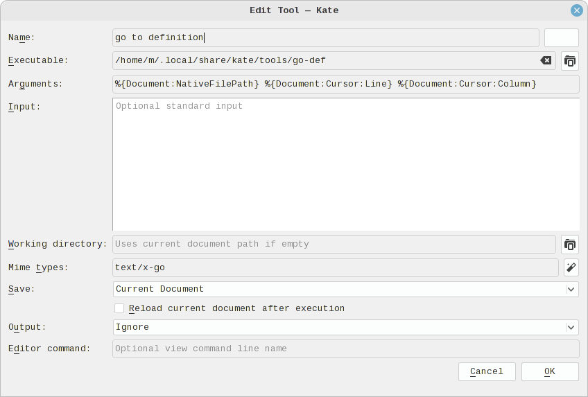

# go-def

`go-def` is a tool for Kate editor for finding symbol definitions in Go source files.
It locates the definition of the symbol under cursor.

### Installation Steps
1. Make sure `Lua5.3` and `guru` are installed:
`sudo apt install lua5.3 && go install golang.org/x/tools/cmd/guru@latest`;
2. Clone this repository and `cd` to it;
3. Either `make install` for the default installation to `$XDG_DATA_HOME/kate/tools/`, where
`$XDG_DATA_HOME` defaults to `$HOME/.local/share`, or type `make` and then copy the file
`go-def` to any suitable location;
4. Add the tool to Kate editor:

5. Optionally add a keyboard shortcut to launch the tool.

### Notes
- I don't know how to make Kate open files in read-only mode from the command line, so just beware
that all files are opened writable.
- The tool uses [`guru`](https://pkg.go.dev/golang.org/x/tools/cmd/guru) for finding the definitions,
and in large projects it can be quite slow to respond (10 seconds or so), while Kate editor provides no
visual feedback, so be patient.

### Status
Tested with Kate version 19.12.3 on Linux Mint 20.3.
